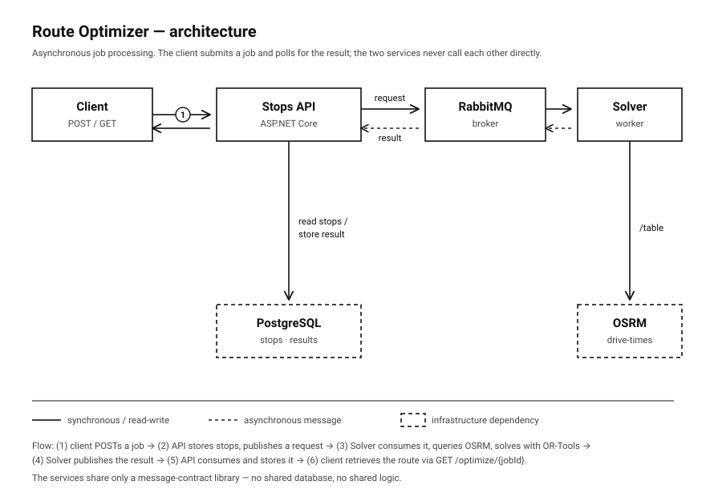

# Route Optimizer

A distributed delivery-route optimization system built in .NET — the problem
companies like Amazon and DPD solve millions of times a day: given one driver
and a set of delivery stops, find the fastest order to visit them all.

The domain is deliberately small. The point is the **architecture**: independent
services communicating asynchronously through a message broker, computing routes
from *real road drive-times* rather than straight-line distance, and designed to
run on a self-hosted Kubernetes cluster.

> Built in public, one commit at a time. The bugs are in the commit history, not
> hidden.

---

## What this demonstrates

- **Genuinely distributed microservices** — separate services communicating over
  HTTP and a durable message queue; the Stops API owns its database and the
  Solver is a stateless worker. Not a monolith split into folders.
- **Asynchronous job processing** — an API accepts a request and returns
  immediately (`202 Accepted`); a separate worker consumes the job, processes it,
  and publishes the result back for the API to store and serve.
- **Real-world routing** — self-hosted OSRM computes actual road drive-times from
  an OpenStreetMap extract. Straight-line distance says Burlington→Toronto is
  ~50 km; the road says ~57 km. That gap is Lake Ontario.
- **Constraint solving** — Google OR-Tools solves the Traveling Salesman Problem
  over an asymmetric, real-world cost matrix.
- **Engineering discipline** — Architecture Decision Records, a full Git workflow
  on every feature, tests that verify the solver against hand-calculated answers,
  and infrastructure defined as code.

**Stack:** C# / .NET 10 · ASP.NET Core · EF Core / PostgreSQL · RabbitMQ ·
Google OR-Tools · self-hosted OSRM · Docker Compose · (target: k3s on ARM)

---

## Architecture

A request flows through the system asynchronously:

1. A client POSTs to the **Stops API** to trigger optimization.
2. The API reads the stops it owns from **PostgreSQL**, publishes an
   `OptimizationRequested` message to **RabbitMQ**, and returns `202 Accepted`
   with a job ID.
3. The **Solver** service — a long-running worker — consumes the message, calls
   **OSRM** for a real drive-time matrix, solves the route with **OR-Tools**, and
   publishes a `RouteOptimized` result back to RabbitMQ.
4. A background consumer in the Stops API stores the result in PostgreSQL.
5. The client retrieves the finished route via `GET /optimize/{jobId}`.

The two services share **only** a message-contract library — no shared database,
no shared business logic. That boundary is what keeps them independent.



---

## Repository structure

```
route-optimizer/
├── services/
│   ├── stops-api/          # ASP.NET Core API — owns stops, publishes jobs,
│   │                       #   consumes results (background service)
│   └── solver/
│       ├── Solver/         # Worker: consumes jobs, OSRM + OR-Tools, publishes results
│       └── Solver.Tests/   # xUnit tests for the solver and distance logic
├── contracts/
│   └── RouteOptimizer.Contracts/   # Shared message contracts (the only coupling)
├── infra/
│   ├── docker-compose.yml  # PostgreSQL + RabbitMQ for local development
│   └── osrm/               # OSRM map data and processing (git-ignored binaries)
├── tools/
│   └── TestPublisher/      # Dev tool: publish a test job without the full API
└── docs/
    ├── adr/                # Architecture Decision Records
    └── architecture.svg    # Architecture diagram
```

---

## Design decisions (ADRs)

Key choices are documented as Architecture Decision Records in
[`docs/adr/`](docs/adr/). So far:

- **[ADR-0001] Monorepo with Per-Service Folders**
  ([`0001-monorepo-and-services.md`](docs/adr/0001-monorepo-and-services.md)) —
  one repo, physically separate services, shared contracts in their own project.
  Trades independent versioning for atomic cross-service changes and simpler
  local development.

Other deliberate choices worth calling out (not yet written up as ADRs):

- **Self-hosted OSRM for routing** — real road drive-times over straight-line
  distance. Introduces a heavy one-time preprocessing step and ~1 GB of RAM, but
  produces materially different (correct) routes — and the drive-time matrix is
  *asymmetric*, because real roads have one-way streets and different on-ramps.
- **Async messaging over synchronous HTTP** between API and solver — the API
  stays responsive, the solver can be down without dropping work (durable
  queues hold messages), and the system can scale to multiple solver instances
  pulling from one queue.
- **`Guid` identifiers** — unique without coordination across services.
  Generated with `Guid.NewGuid()` (random v4).
- **Database-per-service** — enforced physically, not just by convention.

---

## Running it locally

**Prerequisites:** .NET 10 SDK, Docker Desktop. (Apple Silicon / ARM64 works
natively for .NET and OR-Tools; OSRM runs under emulation.)

### 1. Start infrastructure (PostgreSQL + RabbitMQ)

```bash
cd infra
docker compose up -d
# Wait ~20s for RabbitMQ to finish booting.
docker compose ps          # both services should be "Up"
```

RabbitMQ's management UI is at http://localhost:15672 (guest / guest).

### 2. Prepare and start OSRM (one-time preprocessing)

OSRM needs a preprocessed OpenStreetMap extract. Download a regional extract and
run the three-step MLD pipeline (this is a one-time step; the processed files are
git-ignored and reused afterward):

```bash
mkdir -p infra/osrm/data && cd infra/osrm/data

# Download a regional extract (Ontario shown; ~900 MB)
curl -L -O https://download.geofabrik.de/north-america/canada/ontario-latest.osm.pbf

# Preprocess (extract → partition → customize)
docker run -t -v "${PWD}:/data" ghcr.io/project-osrm/osrm-backend \
  osrm-extract -p /opt/car.lua /data/ontario-latest.osm.pbf
docker run -t -v "${PWD}:/data" ghcr.io/project-osrm/osrm-backend \
  osrm-partition /data/ontario-latest.osrm
docker run -t -v "${PWD}:/data" ghcr.io/project-osrm/osrm-backend \
  osrm-customize /data/ontario-latest.osrm
```

Then serve it (leave running in its own terminal):

```bash
docker run -t -i -p 5050:5000 -v "${PWD}:/data" ghcr.io/project-osrm/osrm-backend \
  osrm-routed --algorithm mld /data/ontario-latest.osrm
```

> Note: OSRM binds port 5000 internally; it's mapped to **5050** on the host to
> avoid a conflict with macOS AirPlay Receiver.

### 3. Apply database migrations

```bash
cd services/stops-api
dotnet ef database update
```

### 4. Run the services (each in its own terminal)

```bash
# Solver worker
cd services/solver/Solver && dotnet run

# Stops API
cd services/stops-api && dotnet run
```

### 5. Try it

```bash
# Add some stops (repeat for each; use the API's port)
curl -X POST http://localhost:5276/stops \
  -H "Content-Type: application/json" \
  -d '{"address":"Burlington","latitude":43.3255,"longitude":-79.7990}'

# Trigger optimization — returns 202 with a jobId
curl -i -X POST http://localhost:5276/optimize

# Retrieve the optimized route once processing completes
curl http://localhost:5276/optimize/<jobId>
```

---

## Testing

```bash
dotnet test services/solver/Solver.Tests
```

The solver tests verify correctness against hand-calculated optimal routes — a
known 4-stop problem whose answer (cost 80) was worked out by hand first, so the
tests catch any regression in the solving logic.

---

## Roadmap

- [ ] Leaflet map frontend with draggable pins and live route visualization
- [ ] Deployment to a self-hosted k3s cluster (Oracle Cloud, ARM)
- [ ] Broaden test coverage (OSRM client, message consumers)
- [ ] Multi-vehicle routing (VRP), time windows, capacity constraints
